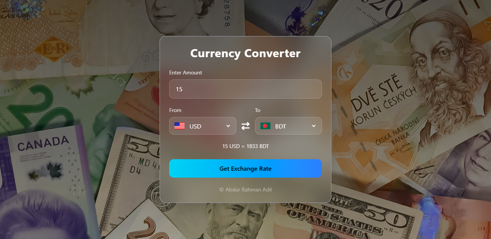

# Currency Converter

A beautiful, modern, and responsive currency converter web application that provides real-time exchange rates between different currencies worldwide.



## ✨ Features

- 🌍 **Real-time Exchange Rates** - Fetches live currency conversion rates using the Hexarate API
- 💎 **Modern Glassmorphism UI** - Beautiful frosted glass effect with backdrop blur
- 🚩 **Country Flags** - Visual representation with flag icons for each currency
- 🔄 **Swap Functionality** - Quickly swap between currencies with animated icon
- ⌨️ **Keyboard Support** - Press Enter to convert instantly
- 📱 **Fully Responsive** - Works seamlessly on desktop, tablet, and mobile devices
- ⚡ **Auto-load Rates** - Displays exchange rate immediately on page load
- ✅ **Input Validation** - Ensures valid amount entries (minimum 1)

## 🛠️ Technologies Used

- **HTML5** - Semantic markup structure
- **Tailwind CSS** - Utility-first CSS framework via CDN
- **JavaScript (ES6+)** - Modern JavaScript with async/await
- **Font Awesome** - Icon library for UI elements
- **Hexarate API** - Real-time currency exchange rate data
- **Flags API** - Country flag images

## 📋 Prerequisites

- Modern web browser (Chrome, Firefox, Safari, Edge)
- Internet connection (for API calls and CDN resources)

## 🚀 Getting Started

1. **Clone the repository**
   ```bash
   git clone https://github.com/SyntaxAdil/currency-converter.git
   ```

2. **Navigate to the project directory**
   ```bash
   cd currency-converter
   ```

3. **Open the project**
   - Simply open `index.html` in your web browser
   - Or use a local development server like Live Server (VS Code extension)

## 📁 Project Structure

```
currency-converter/
│
├── index.html           # Main HTML file
├── src/
│   ├── images/
│   │   └── bg.jpg      # Background image
│   ├── app.js          # Main application logic
│   └── codes.js        # Currency and country codes data
├── preview.png         # Screenshot for README
└── README.md           # Project documentation
```

## 💻 Usage

1. **Enter Amount**: Type the amount you want to convert in the input field
2. **Select Currency**: Choose the source currency from the "From" dropdown
3. **Select Target**: Choose the destination currency from the "To" dropdown
4. **Convert**: Click the "Get Exchange Rate" button or press Enter
5. **View Result**: The conversion result appears below the dropdowns
6. **Swap Currencies**: Click the swap icon between dropdowns to exchange currencies

## 🔑 API Information

This project uses the **Hexarate API** for fetching real-time exchange rates:
- **Endpoint**: `https://hexarate.paikama.co/api/rates/{from}/{to}/latest`
- **No API Key Required** - Free to use
- **Response Format**: JSON with mid-market rates

## 🎨 Customization

### Change Background Image
Replace the background image in the HTML:
```css
bg-[linear-gradient(rgba(0,0,0,0.6),rgba(0,0,0,0.3)),url('./src/images/bg.jpg')]
```

### Modify Colors
Adjust the Tailwind classes in `index.html` to change the color scheme:
- `from-cyan-400 to-blue-500` - Button gradient
- `bg-white/10` - Glass effect transparency
- `border-white/20` - Border opacity

### Add More Currencies
Edit the `codes.js` file to add or remove currency codes and their corresponding country codes.

## 🌐 Browser Support

- ✅ Chrome (latest)
- ✅ Firefox (latest)
- ✅ Safari (latest)
- ✅ Edge (latest)
- ✅ Opera (latest)

## 📸 Screenshots

### Desktop View
The application features a centered glassmorphic card with a beautiful background image, providing an elegant and modern user experience.

### Mobile View
Fully responsive design that adapts seamlessly to smaller screens while maintaining functionality and aesthetics.

## 🤝 Contributing

Contributions, issues, and feature requests are welcome! Feel free to check the [issues page](https://github.com/SyntaxAdil/currency-converter/issues).

1. Fork the project
2. Create your feature branch (`git checkout -b feature/AmazingFeature`)
3. Commit your changes (`git commit -m 'Add some AmazingFeature'`)
4. Push to the branch (`git push origin feature/AmazingFeature`)
5. Open a Pull Request

## 📝 License

This project is open source and available under the [MIT License](LICENSE).

## 👨‍💻 Author

**Abdur Rahman Adil**

- GitHub: [@SyntaxAdil](https://github.com/SyntaxAdil)
- Email: abdurrahmanadil005@gmail.com

## 🙏 Acknowledgments

- [Hexarate API](https://hexarate.paikama.co/) for providing free exchange rate data
- [Flags API](https://flagsapi.com/) for country flag images
- [Font Awesome](https://fontawesome.com/) for beautiful icons
- [Tailwind CSS](https://tailwindcss.com/) for the utility-first CSS framework

## 📊 Project Status

This project is currently in active development. New features and improvements are being added regularly.

---

<div align="center">
  
### ⭐ Star this repository if you find it helpful!

Made with ❤️ by Abdur Rahman Adil

</div>